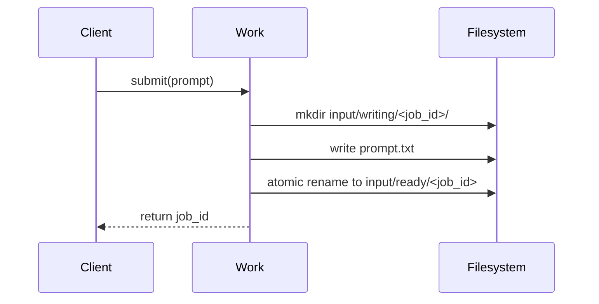
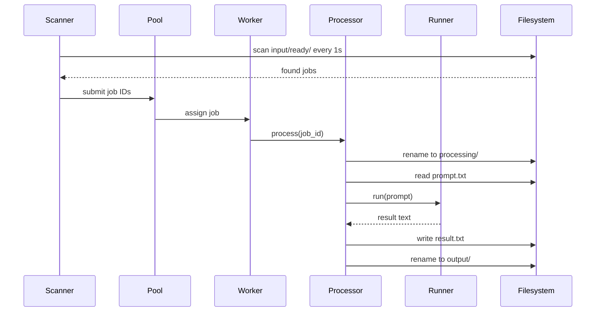
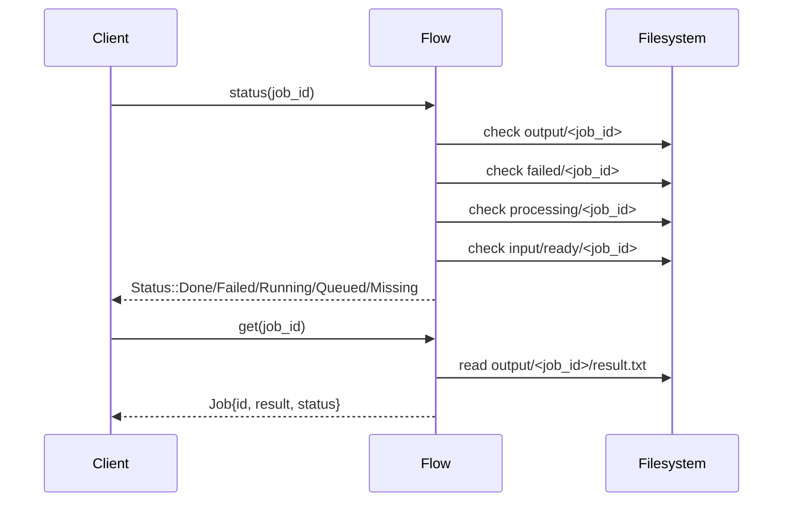

## Overview

nrvna-ai is an **asynchronous inference primitive** - a directory-based job queue for LLM inference using llama.cpp. Jobs are represented as filesystem directories that move through states via atomic renames.

<Info>
The filesystem becomes the state machine. A job's location **is** its state - no database needed.
</Info>

## Core Architecture

The system follows a clean separation of concerns with distinct components handling specific responsibilities:

<CardGroup cols={2}>
  <Card title="Client Layer" icon="user">
    **Work** and **Flow** classes provide the public API for job submission and result retrieval
  </Card>
  <Card title="Server Layer" icon="server">
    **Server** orchestrates all components and manages the lifecycle
  </Card>
  <Card title="Discovery Layer" icon="magnifying-glass">
    **Scanner** finds jobs waiting in the queue
  </Card>
  <Card title="Execution Layer" icon="gears">
    **Pool**, **Processor**, and **Runner** handle concurrent job execution
  </Card>
</CardGroup>

## Component Responsibilities

<AccordionGroup>
  <Accordion title="Work - Job Submission API">
    **Location**: `work.hpp/cpp`
    
    The client-facing API for submitting jobs:
    - Creates job directories in staging area (`input/writing/`)
    - Writes prompt to `prompt.txt`
    - Atomically moves job to ready queue (`input/ready/`)
    - Returns job identifier to client
    
    ```cpp
    [[nodiscard]] SubmitResult submit(const std::string& prompt);
    static JobId generateId() noexcept;
    static bool isValidPrompt(const std::string&) noexcept;
    ```
  </Accordion>

  <Accordion title="Flow - Result Retrieval API">
    **Location**: `flow.hpp/cpp`
    
    The client-facing API for querying job status and results:
    - Checks job state by directory location
    - Retrieves results from `output/` directory
    - Retrieves error messages from `failed/` directory
    
    ```cpp
    [[nodiscard]] Status status(const JobId& id) const noexcept;
    [[nodiscard]] std::optional<Job> get(const JobId& id) const noexcept;
    ```
  </Accordion>

  <Accordion title="Server - Orchestrator">
    **Location**: `server.hpp/cpp`
    
    Manages the entire system lifecycle:
    - Initializes workspace directory structure
    - Creates and manages Scanner and Pool
    - Runs scan loop in dedicated thread
    - Handles graceful shutdown
    - Recovers orphaned jobs on startup
    
    ```cpp
    Server(const std::string& modelPath, 
           const std::filesystem::path& workspace, 
           int workers = 4);
    [[nodiscard]] bool start();
    void shutdown() noexcept;
    ```
  </Accordion>

  <Accordion title="Scanner - Job Discovery">
    **Location**: `scanner.hpp/cpp`
    
    Discovers jobs waiting in the queue:
    - Scans `input/ready/` every 1 second
    - Submits found job IDs to worker pool
    - Single-threaded, runs in dedicated scanner thread
  </Accordion>

  <Accordion title="Pool - Thread Pool Manager">
    **Location**: `pool.hpp/cpp`
    
    Manages concurrent worker threads:
    - Creates N worker threads (default: 4)
    - Maintains job queue with mutex protection
    - Distributes jobs to available workers
    - Uses condition variables for efficient waiting
  </Accordion>

  <Accordion title="Processor - Job Executor">
    **Location**: `processor.hpp/cpp`
    
    Executes individual jobs:
    - Atomically moves job from `ready/` to `processing/`
    - Reads prompt from job directory
    - Calls Runner for inference
    - Writes result and moves job to `output/` or `failed/`
    - Thread-safe, shared across all workers
  </Accordion>

  <Accordion title="Runner - Inference Wrapper">
    **Location**: `runner.hpp/cpp`
    
    Wraps llama.cpp for LLM inference:
    - Each worker has its own Runner instance
    - Shares loaded model across all workers
    - Each Runner has dedicated inference context
    - Handles token generation and sampling
  </Accordion>

  <Accordion title="Logger - Thread-Safe Logging">
    **Location**: `logger.hpp/cpp`
    
    Provides structured logging across all components:
    - Thread-safe with mutex protection
    - Configurable log levels (ERROR, WARN, INFO, DEBUG, TRACE)
    - Named threads for easy debugging
    - Errors to stderr, everything else to stdout
  </Accordion>
</AccordionGroup>

## Directory Structure

The workspace directory acts as the state machine:

```
WORKSPACE/
├── input/
│   ├── writing/      ← Jobs being created (staging area)
│   └── ready/        ← Jobs waiting to be processed
├── processing/       ← Jobs currently running inference
├── output/           ← Completed jobs with results
└── failed/           ← Failed jobs with error messages
```

<Warning>
Never manually move job directories while the server is running. Use atomic filesystem operations if you must interact with the queue.
</Warning>

## Workflow: Job Submission



<Steps>
  <Step title="Client calls Work::submit()">
    Application code submits a prompt string
  </Step>
  <Step title="Create staging directory">
    Work creates `input/writing/<job_id>/`
  </Step>
  <Step title="Write prompt">
    Prompt saved to `input/writing/<job_id>/prompt.txt`
  </Step>
  <Step title="Atomic rename">
    Directory atomically moved to `input/ready/<job_id>`
  </Step>
  <Step title="Return job ID">
    Client receives job identifier for later retrieval
  </Step>
</Steps>

## Workflow: Job Processing



<Steps>
  <Step title="Scanner discovers job">
    Scanner thread finds job in `input/ready/` during periodic scan
  </Step>
  <Step title="Pool assigns to worker">
    Job added to queue and picked up by available worker thread
  </Step>
  <Step title="Processor moves job">
    Job atomically renamed from `ready/` to `processing/`
  </Step>
  <Step title="Read prompt">
    Processor reads `processing/<job_id>/prompt.txt`
  </Step>
  <Step title="Run inference">
    Runner executes llama.cpp inference on the prompt
  </Step>
  <Step title="Write result">
    On success: write `result.txt` and move to `output/`  
    On failure: write `error.txt` and move to `failed/`
  </Step>
</Steps>

## Workflow: Result Retrieval



<CodeGroup>
```cpp Client Code
// Submit job
Work work(workspace);
auto result = work.submit("What is AI?");
if (!result.ok) {
    std::cerr << "Submit failed: " << result.message << std::endl;
    return;
}

// Poll for completion
Flow flow(workspace);
while (true) {
    auto status = flow.status(result.id);
    if (status == Status::Done) break;
    if (status == Status::Failed) {
        std::cerr << "Job failed" << std::endl;
        return;
    }
    std::this_thread::sleep_for(std::chrono::seconds(1));
}

// Retrieve result
auto job = flow.get(result.id);
if (job) {
    std::cout << job->result << std::endl;
}
```

```bash CLI Usage
# Submit job
wrk workspace "What is AI?"
# Output: job_1736700000_12345_0

# Check status and retrieve result
flw workspace job_1736700000_12345_0
```
</CodeGroup>

## Key Design Decisions

<CardGroup cols={2}>
  <Card title="Atomic Renames" icon="arrows-rotate">
    Directory moves are atomic on POSIX filesystems, ensuring thread-safe state transitions without locks
  </Card>
  <Card title="Directory = State" icon="folder">
    Job's location **is** its state - no database, no coordination needed
  </Card>
  <Card title="Shared Model" icon="share-nodes">
    llama.cpp model loaded once in memory, shared across all workers
  </Card>
  <Card title="Per-Thread Context" icon="clone">
    Each worker gets its own inference context for true parallelism
  </Card>
  <Card title="Filesystem-Based" icon="hard-drive">
    Survives process crashes, easy to inspect and debug
  </Card>
  <Card title="No Exceptions" icon="ban">
    All errors returned as values, no exception handling needed
  </Card>
</CardGroup>

## Single Responsibility Principle

Each component has exactly one reason to change:

- **Scanner**: Only discovers jobs in directories
- **Pool**: Only manages worker threads
- **Processor**: Only executes individual jobs
- **Work**: Only job submission and validation
- **Flow**: Only job result retrieval

This design enables easy testing, maintenance, and evolution of the system.

## See Also

<CardGroup cols={2}>
  <Card title="Job Lifecycle" icon="rotate" href="/concepts/job-lifecycle">
    Detailed state machine and transitions
  </Card>
  <Card title="Filesystem Queue" icon="folder-tree" href="/concepts/filesystem-queue">
    Directory-based queue design
  </Card>
  <Card title="Threading Model" icon="layer-group" href="/concepts/threading-model">
    Concurrency and thread safety
  </Card>
  <Card title="CLI Tools" icon="terminal" href="/cli/nrvnad">
    Command-line interface reference
  </Card>
</CardGroup>