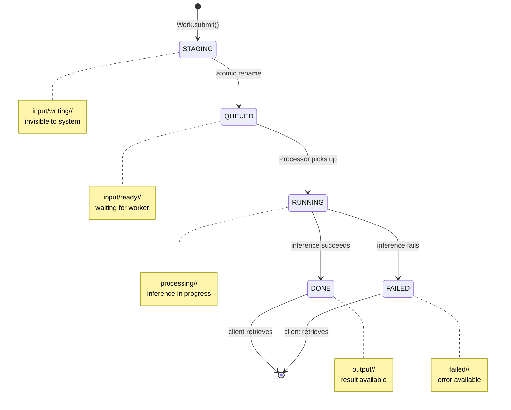

## Overview

In nrvna-ai, jobs move through a well-defined lifecycle represented by their location in the filesystem. The job's directory path **is** the job's state - no database or state tracking needed.

## Job States

Every job exists in exactly one of five states at any given time:

<AccordionGroup>
  <Accordion title="STAGING - Being Created" icon="pen">
    **Directory**: `input/writing/<job_id>/`  
    **Status enum**: Not visible to system yet  
    **Duration**: Milliseconds (during job creation)
    
    Jobs begin here during the submission process. The `writing/` directory acts as a staging area where jobs are assembled before becoming visible to the queue.
    
    **What happens:**
    - Work creates the job directory
    - Prompt is written to `prompt.txt`
    - Job is invisible to Scanner (not yet in `ready/`)
    - Atomic rename moves job to QUEUED state
    
    <Warning>
    Jobs in `writing/` are incomplete and should never be processed. The atomic rename ensures workers never see half-written jobs.
    </Warning>
  </Accordion>

  <Accordion title="QUEUED - Waiting for Processing" icon="clock">
    **Directory**: `input/ready/<job_id>/`  
    **Status enum**: `Status::Queued`  
    **Duration**: Variable (depends on queue depth and worker availability)
    
    Jobs wait here until a worker becomes available. This is the main queue for the inference system.
    
    **What happens:**
    - Scanner discovers job during periodic scan (every 1 second)
    - Job ID submitted to Pool's work queue
    - Job waits for available worker thread
    - When worker picks up job, Processor atomically moves it to RUNNING
    
    <Info>
    Multiple jobs can be queued simultaneously. They're processed in the order discovered by the Scanner.
    </Info>
  </Accordion>

  <Accordion title="RUNNING - Inference in Progress" icon="spinner">
    **Directory**: `processing/<job_id>/`  
    **Status enum**: `Status::Running`  
    **Duration**: Variable (depends on prompt length and model speed)
    
    Jobs are actively being processed by a worker thread.
    
    **What happens:**
    - Worker's Processor atomically renames job from `ready/` to `processing/`
    - Processor reads `prompt.txt` from the job directory
    - Runner executes llama.cpp inference
    - Tokens are generated and accumulated
    - On completion, result written and job moved to DONE or FAILED
    
    <Tip>
    You can monitor active jobs by listing the `processing/` directory. Each subdirectory represents an in-flight job.
    </Tip>
  </Accordion>

  <Accordion title="DONE - Completed Successfully" icon="check">
    **Directory**: `output/<job_id>/`  
    **Status enum**: `Status::Done`  
    **Duration**: Indefinite (until client retrieves or manually cleaned)
    
    Jobs that completed successfully end up here.
    
    **What happens:**
    - Processor writes inference result to `result.txt`
    - Job atomically renamed from `processing/` to `output/`
    - Client can retrieve result using Flow::get()
    - Job remains here until manually cleaned up
    
    **Directory contents:**
    ```
    output/<job_id>/
    ├── prompt.txt    ← original prompt
    └── result.txt    ← inference output
    ```
  </Accordion>

  <Accordion title="FAILED - Error Occurred" icon="xmark">
    **Directory**: `failed/<job_id>/`  
    **Status enum**: `Status::Failed`  
    **Duration**: Indefinite (until manually cleaned)
    
    Jobs that encountered errors during processing.
    
    **What happens:**
    - Processor catches exception or error during inference
    - Error message written to `error.txt`
    - Job atomically renamed from `processing/` to `failed/`
    - Client can retrieve error using Flow::get()
    
    **Directory contents:**
    ```
    failed/<job_id>/
    ├── prompt.txt    ← original prompt
    └── error.txt     ← error message
    ```
    
    **Common failure reasons:**
    - Out of memory during inference
    - Model file corruption
    - Invalid prompt format
    - Context length exceeded
  </Accordion>

  <Accordion title="MISSING - Not Found" icon="question">
    **Directory**: None  
    **Status enum**: `Status::Missing`  
    **Duration**: N/A
    
    The job ID doesn't exist in any directory.
    
    **Possible reasons:**
    - Invalid or typo'd job ID
    - Job was manually deleted
    - Job hasn't been submitted yet
    - Workspace was cleared
  </Accordion>
</AccordionGroup>

## State Machine

The job lifecycle follows a strict state machine with atomic transitions:



## State Transitions

All state transitions are implemented as atomic directory renames:

<CodeGroup>
```cpp STAGING → QUEUED
// In Work::submit()
namespace fs = std::filesystem;

fs::path staging = workspace_ / "input/writing" / job_id;
fs::path ready = workspace_ / "input/ready" / job_id;

// Atomic rename - job becomes visible to Scanner
fs::rename(staging, ready);
```

```cpp QUEUED → RUNNING
// In Processor::process()
namespace fs = std::filesystem;

fs::path ready = workspace_ / "input/ready" / job_id;
fs::path processing = workspace_ / "processing" / job_id;

// Atomic rename - worker claims the job
fs::rename(ready, processing);
```

```cpp RUNNING → DONE
// In Processor::process() after successful inference
namespace fs = std::filesystem;

fs::path processing = workspace_ / "processing" / job_id;
fs::path output = workspace_ / "output" / job_id;

// Write result first
writeFile(processing / "result.txt", result);

// Then atomic rename - job is complete
fs::rename(processing, output);
```

```cpp RUNNING → FAILED
// In Processor::process() after error
namespace fs = std::filesystem;

fs::path processing = workspace_ / "processing" / job_id;
fs::path failed = workspace_ / "failed" / job_id;

// Write error first
writeFile(processing / "error.txt", error_message);

// Then atomic rename - job failed
fs::rename(processing, failed);
```
</CodeGroup>

## Status Detection

The Flow class determines job status by checking directory existence in order:

```cpp
Status Flow::status(const JobId& id) const noexcept {
    namespace fs = std::filesystem;
    
    // Check in priority order
    if (fs::exists(workspace_ / "output" / id))     return Status::Done;
    if (fs::exists(workspace_ / "failed" / id))     return Status::Failed;
    if (fs::exists(workspace_ / "processing" / id)) return Status::Running;
    if (fs::exists(workspace_ / "input/ready" / id)) return Status::Queued;
    
    return Status::Missing;
}
```

<Note>
The `Status` enum is defined in `types.hpp` as a `uint8_t` for compact representation:

```cpp
enum class Status : std::uint8_t { 
    Queued, Running, Done, Failed, Missing 
};
```
</Note>

## Job Identifier Format

Job IDs are generated using a timestamp-based format:

```
<unix_timestamp>_<process_id>_<counter>
```

**Example:** `1736700000_12345_0`

- `1736700000` - Unix timestamp (seconds since epoch)
- `12345` - Process ID of the client
- `0` - Atomic counter within the process

This ensures:
- **Uniqueness**: Across processes and time
- **Sortability**: Chronological ordering
- **Debuggability**: Timestamp visible in the ID

<CodeGroup>
```cpp C++ Generation
using JobId = std::string;

static JobId Work::generateId() noexcept {
    static std::atomic<uint64_t> counter{0};
    auto timestamp = std::time(nullptr);
    auto pid = getpid();
    auto count = counter.fetch_add(1);
    
    return std::to_string(timestamp) + "_" + 
           std::to_string(pid) + "_" + 
           std::to_string(count);
}
```

```bash CLI Output
$ wrk workspace "What is AI?"
job_1736700000_12345_0

$ wrk workspace "Explain quantum computing"
job_1736700001_12345_1
```
</CodeGroup>

## Orphaned Job Recovery

When the server starts, it checks for orphaned jobs that were left in `processing/` due to crashes:

```cpp
bool Server::recoverOrphanedJobs() noexcept {
    namespace fs = std::filesystem;
    
    auto processing = workspace_ / "processing";
    if (!fs::exists(processing)) return true;
    
    // Move all orphaned jobs back to ready queue
    for (const auto& entry : fs::directory_iterator(processing)) {
        auto ready = workspace_ / "input/ready" / entry.path().filename();
        fs::rename(entry.path(), ready);
        LOG_WARN("Recovered orphaned job: " + entry.path().filename().string());
    }
    
    return true;
}
```

<Warning>
Orphaned jobs are moved back to `ready/` queue on server restart. They will be reprocessed from scratch - inference is **not** resumed from checkpoint.
</Warning>

## Monitoring Job Progress

<Tabs>
  <Tab title="Filesystem">
    Monitor jobs by watching directory changes:
    
    ```bash
    # Watch for new jobs
    watch -n 1 'ls -lt workspace/input/ready/'
    
    # Monitor active jobs
    watch -n 1 'ls -lt workspace/processing/'
    
    # Check completed jobs
    ls -lt workspace/output/
    ```
  </Tab>
  
  <Tab title="C++ API">
    Poll job status programmatically:
    
    ```cpp
    Flow flow(workspace);
    
    while (true) {
        auto status = flow.status(job_id);
        
        switch (status) {
            case Status::Queued:
                std::cout << "Waiting in queue..." << std::endl;
                break;
            case Status::Running:
                std::cout << "Processing..." << std::endl;
                break;
            case Status::Done:
                auto job = flow.get(job_id);
                std::cout << "Result: " << job->result << std::endl;
                return;
            case Status::Failed:
                auto job = flow.get(job_id);
                std::cerr << "Error: " << job->error << std::endl;
                return;
            case Status::Missing:
                std::cerr << "Job not found" << std::endl;
                return;
        }
        
        std::this_thread::sleep_for(std::chrono::seconds(1));
    }
    ```
  </Tab>
  
  <Tab title="CLI">
    Use the `flw` command to check status:
    
    ```bash
    # Poll until complete
    while true; do
        flw workspace job_1736700000_12345_0 && break
        sleep 1
    done
    ```
  </Tab>
</Tabs>

## Best Practices

<CardGroup cols={2}>
  <Card title="Don't Poll Too Aggressively" icon="hourglass">
    Poll every 1-5 seconds. Jobs typically take seconds to minutes to complete.
  </Card>
  <Card title="Clean Up Completed Jobs" icon="trash">
    Manually delete jobs from `output/` and `failed/` to prevent disk buildup.
  </Card>
  <Card title="Check for FAILED State" icon="triangle-exclamation">
    Always handle the FAILED state in your client code.
  </Card>
  <Card title="Never Modify Directories Manually" icon="ban">
    Let the system manage state transitions. Manual moves can cause race conditions.
  </Card>
</CardGroup>

## See Also

<CardGroup cols={2}>
  <Card title="Architecture" icon="sitemap" href="/concepts/architecture">
    Overall system design and components
  </Card>
  <Card title="Filesystem Queue" icon="folder-tree" href="/concepts/filesystem-queue">
    Directory-based queue implementation
  </Card>
  <Card title="Work API" icon="code" href="/api/work">
    Job submission API reference
  </Card>
  <Card title="Flow API" icon="code" href="/api/flow">
    Result retrieval API reference
  </Card>
</CardGroup>